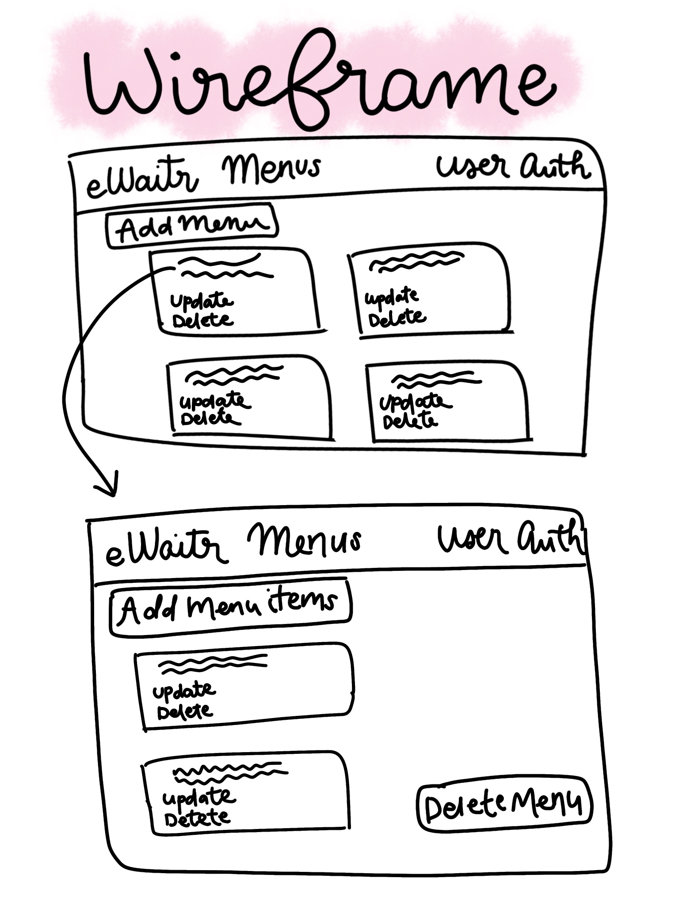

# eWaitr
My vision for this web app is for restaurants to be able to create their menus and have their customers be able to view their menu on an iPad or some other tablet device. Customers would be able to make orders and be sent to the kitchen without the need for a waiter to come to their table and take their order. It would provide much quicker service at restaurants without having to wait for the the waiter to be available to come by the table and take your order. Instead, the host will be able to seat their customers at the table with the app open and they can choose from the menu what they want to order immediately.

## Deployed Front-End Application
[Deployed application on GH pages](https://katwu90.github.io/eWaitr/)

## eWaitr Front-End Application Repository
[Github Repository for eWaitr Front-end](https://github.com/katwu90/eWaitr)

## Deployed API on Heroku
[Deployed API](https://ewaitr.herokuapp.com/)

## eWaitr API Repository
[Github Repository for eWaitr API](https://github.com/katwu90/eWaitr-rails-back-end).

## Planning Process and Problem-Solving Strategies
My

## Technologies Used
- HTML
- CSS
- Bootstrap
- Javascript
- Ember.js
- Handlbars
- Ruby on Rails
- PostgreSQL
- Heroku
- Git/Github

## User Stories
A restaurant can sign up for an account.
A registered restaurant can sign in.
A registered restaurant can sign out.
A registered restaurant can their change password.
A registered restaurant can create a menu.
A registered restaurant can add items to their menu.
A registered restaurant can delete a menu.
A registered restaurant can delete items to their menu.
A registered restaurant can edit a menu.
A registered restaurant can edit items to their menu.
A registered restaurant can view all menus.
A registered restaurant can view all items in their menus.

## Wireframe

### Application Preview

## Work To Be Continued
The other resources (customers & orders) for this application has not been implemented yet. I am still working on creating a customers and customers making orders. I will also eventually want to create a separate table for Food Categories so that all the appetizers and entrees are grouped together, instead of separately as they are right now.
